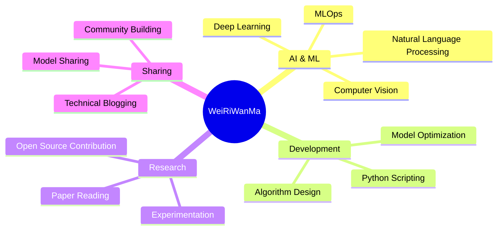

  
# 🚀 Welcome to WeiRiWanMa's Digital Universe! 🌟

  
  

---

## 🏷️ About WeiRiWanMa

### 🎯 Focus Areas

### 💻 Programming Languages

  
  
  

### 🧠 Deep Learning Frameworks

  
  
  
  
  

### 🔧 Tools & Platforms

  
  
  
  

  
  
  

---

## 📊 GitHub Analytics

  

  

---

## 🏆 GitHub Trophies

  

---

## 🌐 Connect & Explore

### 📝 My Digital Footprints

  
  

### 💬 Let's Connect!

  
  

---

## 🎨 Fun Facts & Interests

---

## 🚀 Current Focus

| 🔭 Currently Working On | 🌱 Currently Learning | 👯 Looking to Collaborate |
|:---:|:---:|:---:|
| AI Model Development | Advanced MLOps | Open Source AI Projects |
| Deep Learning Research | Transformer Architectures | Research Publications |
| Technical Writing | Model Deployment | Community Building |

---

### 💫 "The best way to predict the future is to create it" 

⭐️ From [WeiRiWanMa](https://github.com/WeiRiWanMa) | 让我们一起用代码改变世界! 🌍

